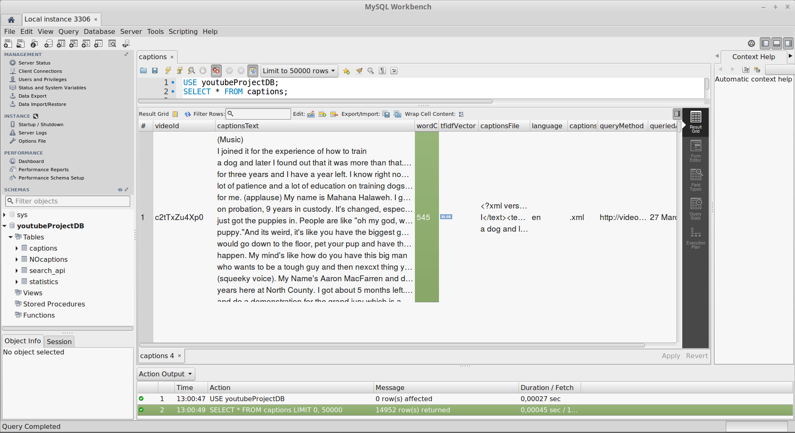

# youtube-curation

This project tests if you can curate youtube videos based mainly on the transcript of the video and how close the text of that transcript is to a published work supplied by the user. In particular, curating materials that can be used for learning, be it how-to's, recipes, or tutorials. 

The code in the repository carries out several functions:
* setting up MySQL database schema, querying youtube video data and populating the database with captions text and some video statistics such as numbers of views, likes and dislikes [1](https://github.com/aktivkohle/youtube-curation/blob/master/searchAPIandLoad_ProductionVersion.py), [2](https://github.com/aktivkohle/youtube-curation/blob/master/PullIDsfromSQL_RetrieveLikesDislikes.py), [3](https://github.com/aktivkohle/youtube-curation/blob/master/captionsYoutube_dl_SQL.py), [4](https://github.com/aktivkohle/youtube-curation/blob/master/wordCountColumn.py), [5](https://github.com/aktivkohle/youtube-curation/blob/master/runAll.py)
* natural language processing scripts which clean and vectorise each caption text with spaCy and Scikit Learn and store the vectors as blob type back in the database
* a script which pulls the vectors out and reassembles them into a matrix, then performs some matrix algebra to create a 'similarity' matrix where also one new piece of text from the user can be compared against all the other captions and  the six most similar are shown to the user
* frontend scripts which create a basic website with Twitter Bootstrap, Python Flask and Jinja2 templating engine to accept the text from the user and call the videos onto the screen from Youtube which were found by the algorithm

* Jupyter notebooks that were used to originally develop the NLP scripts [5](https://github.com/aktivkohle/youtube-curation/blob/master/notebooks/TextbooksAndCaptions_Similarity.ipynb)
* A notebook which graphically tells you what is in the database with respect to time and topic [6](https://github.com/aktivkohle/youtube-curation/blob/master/notebooks/whatsInThere.ipynb)
* A listing of all useful SQL queries for looking into the database and creating queries for the ETL scripts [7](https://github.com/aktivkohle/youtube-curation/blob/master/usefulQueries.sql)

15000 captions texts are stored of which 8000 are in English. For the moment, I have stuck with English as the NLP scripts need an extra level of functionality otherwise. To ensure the vectors stored in the database all have exactly the same length in one dimension, the vocabulary file is also [stored](https://github.com/aktivkohle/youtube-curation/blob/master/vocab_from_allEnglish_captions_and_some_texts.pickle) here on github, it contains 429429 words (coincidence it was such a number..)

The vectorizing is the slowest process, it takes about an hour to vectorize 8000 texts and store them in the database, even though they can be pulled out of the database in seconds. It takes again seconds to pull them all out again and store them in memory, and once the similarity matrix is in memory, it takes about 40mS to compute the most similar texts against the one supplied by the user. Again, the most time consuming part of that is to vectorize the users text, not to do a bit of matrix algebra. If the matrix were a lot bigger, millions rather than thousands of rows it might get slower and need other approaches but for now it works. 

Here is a screenshot of the captions table being queried, just to get a feel for the content of the backend:

